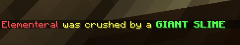

# CustomDeathMessages

CustomDeathMessages replaces vanilla death messages with configurable templates for PvP, mobs, projectiles, environmental causes, and unknown fallback deaths. It supports legacy and modern Spigot/Paper servers from 1.8 through 1.21.x, includes in-game editing commands, and can forward custom death messages to Discord when a supported bridge is installed.

## Features

- Custom message lists for PvP, melee, projectile, environmental, mob, and fallback death causes.
- Toggleable global death messages.
- Toggleable PvP messages sent directly to the killer and victim.
- Optional hover text showing the original vanilla death message.
- Optional hoverable weapon/item component for `%kill-weapon%`.
- Optional lightning strike effect at the death location.
- Optional player head drops with configurable drop chance and display name.
- Per-player death message cooldown to reduce spam.
- Custom named entity messages that can override the normal mob-group message.
- Hex color support using `&#RRGGBB`.
- Discord forwarding through `EssentialsDiscord` or `DiscordSRV` when either plugin is installed.
- Update notifications for staff with `cdm.updates`.
- Developer debug commands gated behind `developer-mode`.

## Commands

Primary command aliases: `/cdm`, `/customdeathmessages`, `/customdeathmessage`, `/deathmessage`, `/deathmessages`

| Command | Permission | Notes |
| --- | --- | --- |
| `/cdm reload` | `cdm.reload` | Reloads the config and clears cached cooldown/propagated death state. |
| `/cdm add <path> <death message>` | `cdm.modify` | Adds a message to a death-message list. |
| `/cdm list <path>` | `cdm.modify` | Lists the configured messages for a death-message path with indices. |
| `/cdm remove <path> <index>` | `cdm.modify` | Removes a message by index. The last message in a list cannot be removed. |
| `/cdm set flag <path> <true\|false>` | `cdm.modify` | Sets a boolean config value. |
| `/cdm set message <path> <message>` | `cdm.modify` | Sets a string config value. |
| `/cdm set number <path> <value>` | `cdm.modify` | Sets a numeric config value. |
| `/cdm debug prime [player]` | `cdm.debug` | Sets a player to 1 health for testing. Requires `developer-mode: true`. |
| `/cdm debug shoot [player]` | `cdm.debug` | Instantly kills a player for testing. Requires `developer-mode: true`. |
| `/cdm debug hover [player]` | `cdm.debug` | Sends a test hover-item death message using the item in your hand. Requires `developer-mode: true`. |

`/cdm` config path arguments are tab-completed. Death-message-path arguments are also tab-completed from the supported `*-messages` sections in `config.yml`.

## Config Overview

Boolean paths available to `/cdm set flag`:

- `enable-update-messages`
- `enable-pvp-messages`
- `enable-lightning`
- `enable-global-messages`
- `enable-original-on-hover`
- `enable-item-on-hover`
- `enable-custom-name-entity-messages`
- `developer-mode`

String paths available to `/cdm set message`:

- `killer-message`
- `victim-message`
- `head-name`

Number paths available to `/cdm set number`:

- `drop-head-percentage`
- `message-cooldown`

Death-message lists are configured in the many `*-messages` sections in `config.yml`, including paths such as:

- `global-pvp-death-messages`
- `melee-death-messages`
- `custom-name-entity-messages`
- `fall-damage-messages`
- `creeper-messages`
- `zombified-piglin-messages`
- `warden-sonic-boom-messages`
- `arrow-messages`
- `fireball-messages`
- `unknown-messages`

The shipped config also includes many other mob and damage-cause sections. Add, remove, or edit those lists directly in `config.yml` or with `/cdm add`, `/cdm list`, and `/cdm remove`.

## Placeholders

Available player placeholders:

- `%victim%`
- `%victim-nick%`
- `%victim-x%`
- `%victim-y%`
- `%victim-z%`
- `%victim-world%`

Available killer/entity placeholders when a killer exists:

- `%killer%`
- `%killer-x%`
- `%killer-y%`
- `%killer-z%`
- `%killer-world%`
- `%entity-name%`

Additional player-killer placeholder:

- `%killer-nick%`

Weapon placeholder for PvP/weapon-based messages:

- `%kill-weapon%`

When item hover is enabled, `%kill-weapon%` can render as a hoverable item component. When item hover is disabled, it resolves to the weapon name when available.

## Notes

- `cdm.updates` allows a player to receive update-check notifications on login when `enable-update-messages` is enabled.
- `config-version` is managed by the plugin and should not be edited manually.
- If a death cause is not explicitly mapped, the plugin falls back to `unknown-messages`.
